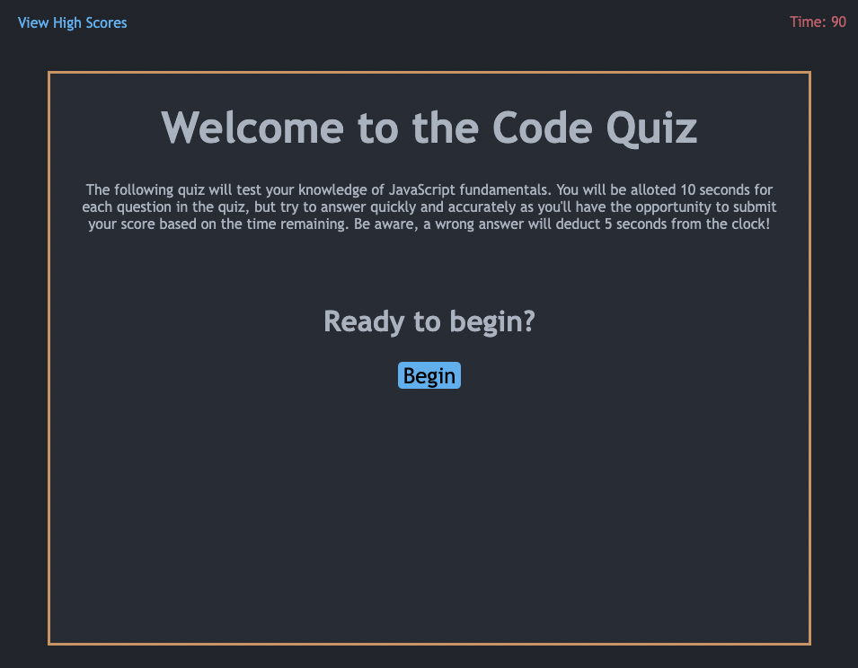

# code-quiz
Deployed App: [Code Quiz](http://highdynamics.github.io/code-quiz)

## Features
- Answer questions about fundamental JavaScript
- A timer to keep track of user's score
- Shows correct answer if user answers incorrectly
- Deduction in time (-5s) if user answers incorrectly
- Randomized answer order to keep user on their toes
- Ability to submit highscore to local storage to keep track of progress
- Ability to clear highscores to start anew!